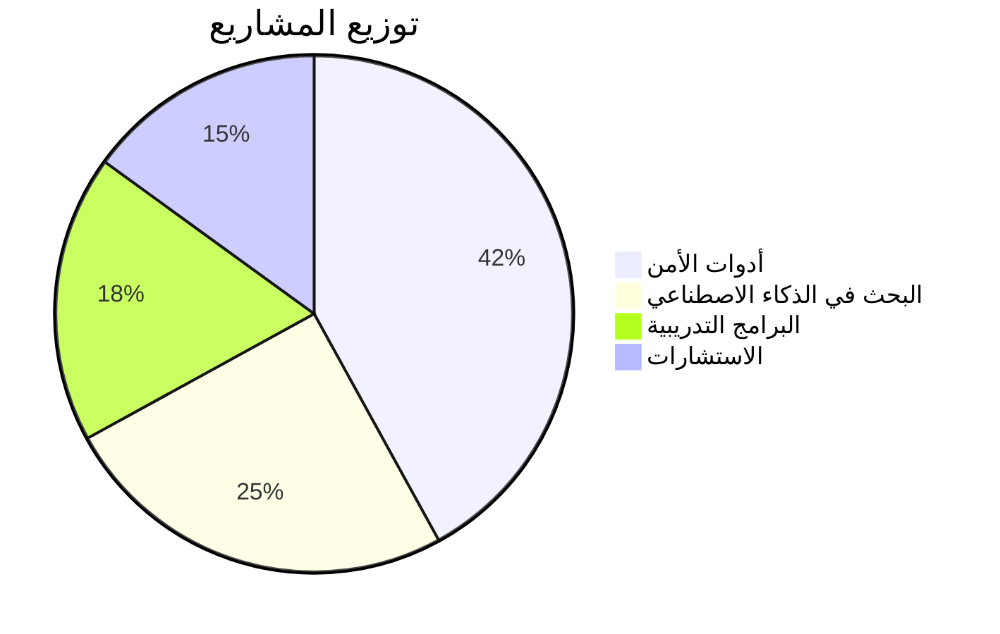
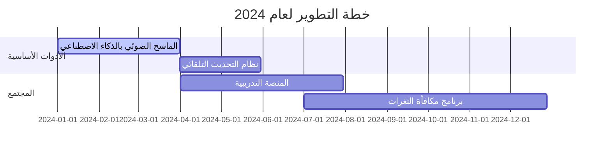
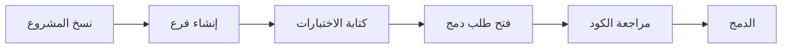

<meta name="description" content="Black Wolf Team - Elite cybersecurity experts in penetration testing, ethical hacking, and AI-driven security solutions. Open-source tools for vulnerability assessment, network analysis, and threat detection.">

<h1 align="center">
  
</h1>

<div align="center">
  <p><em>Empowering the Next Generation of Cybersecurity Experts</em></p>

  [](https://discord.gg/blackwolf)
  [](https://github.com/blackwolfteam)
  [](LICENSE)
</div>

---

## 📖 جدول المحتويات
<details>
  <summary>انقر للعرض</summary>

- [🌟 من نحن؟](#-من-نحن)
  - [الإنجازات الرئيسية](#الإنجازات-الرئيسية)
  - [القيم الأساسية](#القيم-الأساسية)
- [🎯 رؤيتنا](#-رؤيتنا)
  - [الرسالة](#الرسالة)
  - [القيم الاستراتيجية](#القيم-الاستراتيجية)
  - [خارطة طريق 2024](#خارطة-طريق-2024)
- [💡 لماذا نختارنا؟](#-لماذا-نختارنا)
- [🔥 التخصصات](#-التخصصات)
  - [الأدوات والمشاريع](#الأدوات-والمشاريع)
  - [الميزات القادمة](#الميزات-القادمة)
- [🚀 البدء السريع](#-البدء-السريع)
- [🤝 دليل المساهمة](#-دليل-المساهمة)
- [🔒 الأمان والامتثال](#-الأمان-والامتثال)
- [📞 التواصل](#-التواصل)
- [❓ الأسئلة الشائعة](#-الأسئلة-الشائعة)
</details>

---

## 🌟 من نحن؟
تأسس فريق الذئب الأسود عام 2018 كمجموعة نخبة من خبراء الأمن السيبراني، نمت لتشمل أكثر من 55 عضوًا من 15 دولة مختلفة.



### الإنجازات الرئيسية
- 🏆 أبطال DEF CON CTF 2021-2023
- 🔓 اكتشاف 2000+ ثغرة أمنية
- 🚀 1M+ تنزيل لأدواتنا مفتوحة المصدر
- 🌍 حماية 150+ عميل مؤسسي

### القيم الأساسية
- 🔐 **الأمان أولاً** - لا مساومة على الجودة
- 💡 **الابتكار** - 30% من الميزانية للبحث والتطوير
- 🤝 **الشفافية** - سياسة المصدر المفتوح
- 🌱 **التعليم** - ورش عمل مجانية شهرية

[تعرف على الفريق →](#)

---

## 🎯 رؤيتنا

### الرسالة
"قيادة الثورة الأمنية المدعومة بالذكاء الاصطناعي من خلال البحث المتقدم وتمكين المجتمع"

### القيم الاستراتيجية
1. تطوير حلول أمنية استباقية
2. بناء مجتمع أمني عالمي
3. الريادة في أبحاث الذكاء الاصطناعي الأمني

### خارطة طريق 2024


---

## 💡 لماذا نختارنا؟
<div align="center">
  
</div>

**ثقة المؤسسات:**
> "خفضنا وقت الاستجابة للحوادث بنسبة 83% مع الحفاظ على 100% توافق"  
> — **مدير أمن معلومات في مؤسسة مالية عالمية**

**المزايا التقنية:**
- 🚀 كشف التهديدات في الوقت الحقيقي (50 مللي ثانية)
- 📈 دقة 99.97% في توقع الثغرات
- 🌐 دعم متعدد السحابات (AWS/Azure/GCP)
- 🔄 أنابيب أمنية أوتوماتيكية للتكامل المستمر

---

## 🔥 التخصصات

### الأدوات والمشاريع
<div class="cards-container">
  <div class="card">
    <h3>🛡️ أدوات الهجوم</h3>
    <ul>
      <li><a href="https://">WolfScan</a> - منصة اختبار الاختراق بالذكاء الاصطناعي</li>
      <li><b>الإصدار:</b> 2.4.1</li>
      <li><b>التوثيق:</b> <a href="https://">الاطلاع</a></li>
    </ul>
  </div>

  <div class="card">
    <h3>🔍 التحليل</h3>
    <ul>
      <li><a href="https://">ThreatMapper</a> - مصور الشبكات</li>
      <li><b>الإصدار:</b> 1.9.3</li>
      <li><b>المتطلبات:</b> 4GB RAM</li>
    </ul>
  </div>
</div>

### الميزات القادمة
- 🔥 كشف الثغرات اليوم-صفر (Q3 2024)
- 🌍 دعم اللغات العربية والصينية
- 📱 أدوات أمن الأجهزة المحمولة

[عرض جميع المشاريع →](https://github.com/blackwolfteam)

---

## 🚀 البدء السريع

**التثبيت السريع:**
```bash
# لأنظمة لينكس/ماك
curl -sSL https://install.blackwolf.com | bash -s -- --prod
```

**تهيئة Docker:**
```yaml
version: '3.8'
services:
  core-engine:
    image: blackwolfteam/core-engine:latest
    ports:
      - "443:3443"
    volumes:
      - ./wolfconfig:/config
```

**أمثلة التكوين:**
```json
{
  "scan_profile": "aggressive",
  "report_format": "PDF",
  "notifications": {
    "email": "admin@example.com",
    "slack_webhook": "https://hooks.slack.com/..."
  }
}
```

[الدليل الكامل للنشر →](https://docs.blackwolf.com)

---

## 🤝 دليل المساهمة



**للمساهمين الجدد:**
1. اختر من [المهام السهلة](https://github.com/blackwolfteam/core-tools/issues?q=is:open+label:"good+first+issue")
2. انضم إلى [برنامج الإرشاد](#)
3. احضر جلسات الأسئلة الأسبوعية (كل جمعة)

[شروط المساهمة →](CONTRIBUTING.md)

---

## 🔒 الأمان والامتثال

### سياسة الإبلاغ عن الثغرات
1. الإبلاغ عبر [security@blackwolf.com](mailto:security@blackwolf.com)
2. التحقق خلال 24 ساعة
3. إصلاح خلال 3-7 أيام عمل
4. الإعلان العام بعد التحديث

### المعايير المدعومة
- ISO 27001
- NIST Cybersecurity Framework
- PCI DSS 4.0

[تقرير الأمان الكامل →](https://blackwolf.com/security)

---

## 📞 التواصل

**قنوات الدعم:**
- 🚨 مشكلات حرجة: [security@blackwolf.com](mailto:security@blackwolf.com)
- 💬 استفسارات عامة: [دعم Discord](https://discord.gg/blackwolf)
- 📝 طلبات ميزات جديدة: [مناقشات GitHub](https://github.com/blackwolfteam/discussions)

**المكاتب العالمية:**
- دبي: +971 4 123 4567
- سنغافورة: +65 6808 1234
- برلين: +49 30 901820

---

## ❓ الأسئلة الشائعة

<details>
<summary>ما هي القطاعات التي تتخصصون فيها؟</summary>
  
نمتلك خبرة واسعة في:
- الخدمات المالية (PCI DSS)
- الرعاية الصحية (HIPAA)
- الحكومة (NIST)
- أمن إنترنت الأشياء
</details>

<details>
<summary>كيف تتعاملون مع الثغرات الأمنية؟</summary>

عملية من 4 خطوات:
1. الإبلاغ عبر البريد الأمني
2. التحقق خلال 24 ساعة
3. التطوير خلال 3.7 أيام في المتوسط
4. الإعلان العام
</details>

[عرض جميع الأسئلة →](https://blackwolf.com/faq)

---

<div align="center">
  <sub>© 2024 فريق الذئب الأسود | تابعونا على [تويتر](https://twitter.com/blackwolfteam)</sub>
  <br>
  <a href="#top">العودة إلى الأعلى ↑</a>
</div>

<style>
  .cards-container {
    display: grid;
    grid-template-columns: repeat(auto-fit, minmax(300px, 1fr));
    gap: 1rem;
    margin: 2rem 0;
  }
  
  .card {
    border: 1px solid #2d333b;
    border-radius: 8px;
    padding: 1.5rem;
    transition: transform 0.2s;
  }
  
  .card:hover {
    transform: translateY(-5px);
    box-shadow: 0 4px 8px rgba(0,0,0,0.1);
  }
  
  .card h3 {
    margin-top: 0;
    color: #58a6ff;
  }
</style>
