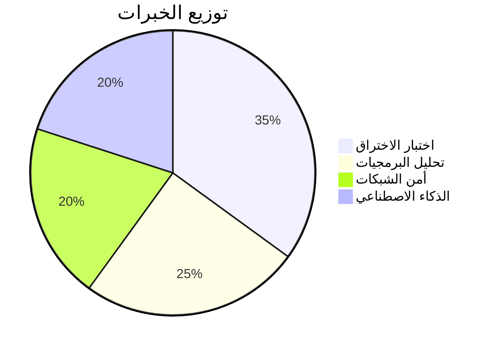

<!DOCTYPE html>
<html dir="rtl" lang="ar">
<head>
    <meta charset="UTF-8">
    <meta name="viewport" content="width=device-width, initial-scale=1.0">
    <meta name="description" content="فريق Black Wolf - خبراء الأمن السيبراني المتميزون في اختبار الاختراق والقرصنة الأخلاقية وحلول الأمان التي تعتمد على الذكاء الاصطناعي. أدوات مفتوحة المصدر لتقييم نقاط الضعف وتحليل الشبكات واكتشاف التهديدات.">
</head>
<body>

  <picture>
    <source media="(prefers-color-scheme: dark)" srcset="https://example.com/black-wolf-logo-dark.svg">
    
  </picture>
  
  <h1 class="gradient-title">
    الذئب الأسود | فريق الذئب الأسود
  </h1>

  

    
    
    
  

---

## جدول المحتويات التفاعلي

  <a href="#من-نحن" class="toc-card">
    <h3>🦾 من نحن؟</h3>
    
تعرف على فريقنا وإنجازاتنا

  </a>
  <a href="#رؤيتنا" class="toc-card">
    <h3>🎯 الرؤية</h3>
    
خطة 2024 والاستراتيجيات

  </a>
  <a href="#التخصصات" class="toc-card">
    <h3>🛠️ التخصصات</h3>
    
الأدوات والمشاريع الجارية

  </a>
  <a href="#التواصل" class="toc-card">
    <h3>📬 التواصل</h3>
    
قنوات الدعم والاتصال

  </a>

---

## 🦾 من نحن؟

  

    
55+

    
خبير أمني

  

  

    
2000+

    
ثغرة مكتشفة

  

  

    
99.97%

    
دقة الكشف

  

---

## 🎯 الرؤية والاستراتيجية

  

    

      الربع الأول من عام 2024
      <ul>
        <li>إطلاق WolfScan v3</li>
        <li>دعم اللغات العربية</li>
      </ul>
    

    

      الربع الثاني من عام 2024
      <ul>
        <li>منصة التدريب التفاعلي</li>
        <li>تكامل مع AWS Security Hub</li>
      </ul>
    

  

---

## 🛠️ الأدوات الرئيسية

  

    <h3>🔍 WolfScan</h3>
    
منصة اختبار الاختراق بالذكاء الاصطناعي

    

      
      
    

    <a href="#" class="download-btn">التوثيق الكامل →</a>
  

  
  

    <h3>🗺️ ThreatMapper</h3>
    
تحليل الشبكات والتهديدات

    

      
      
    

    <a href="#" class="download-btn">دليل الاستخدام →</a>
  

---

## 📬 قنوات التواصل

  <a href="mailto:security@blackwolf.com" class="contact-card">
    <h3>📧 البريد الأمني</h3>
    
للإبلاغ عن الثغرات

  </a>
  <a href="https://discord.gg/blackwolf" class="contact-card">
    <h3>مجتمع الديسكورد</h3>
    
للأسئلة العامة

  </a>
  <a href="https://github.com/blackwolfteam/discussions" class="contact-card">
    <h3>💬 مناقشات GitHub</h3>
    
للمقترحات التقنية

  </a>

---

  © 2024 فريق الذئب الأسود | [الخصوصية](/#) | [الشروط](/#)
   
  

    
    
  

</body>
</html>
