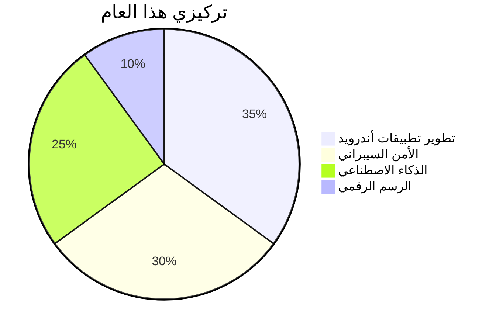

# 🚀 مرحباً، أنا إبراهيم حامد (الـجُن) 
### **مطور Full-Stack | مُهندس أندرويد | هاكر أخلاقي**
<div align="center">
  
</div>

---

## 🌟 **عالمي التقني**
<div align="center">
  
**🧰 الأدوات المفضلة:**  


**🔐 الأمن السيبراني:**  


</div>

---

## 🎨 **هواياتي خارج الكود**
<div align="center" style="display: flex; justify-content: center; gap: 10px; flex-wrap: wrap;">

<div style="text-align: center;">
  <br>
  <strong>🥊 الملاكمة</strong><br>
  <em>تدريب يومي | قوة تركيز</em>
</div>

<div style="text-align: center;">
  <br>
  <strong>🎨 الرسم الرقمي</strong><br>
  <em>بورتريهات | شخصيات أنمي</em>
</div>

<div style="text-align: center;">
  <br>
  <strong>🏎️ القيادة المتهورة</strong><br>
  <em>سباقات | تحديات السرعة</em>
</div>

</div>

---

## 💎 **المشاريع المميزة**
### 🔮 **Solo Leveling Universe (نظام متكامل)**
```python
class LifeUpgrader:
    def __init__(self):
        self.features = {
            "fitness": "نظام تمارين ذكي",
            "social": "تواصل آمن مع الأصدقاء",
            "nutrition": "حساب السعرات الحرارية",
            "security": "حماية من الاختراق"
        }
    
    def unleash_power(self):
        return "🚀 Level Up!"
```

**📌 مميزات فريدة:**
- 🧠 ذكاء اصطناعي لتحليل أداء المستخدم
- 🔒 تشفير AES-256 للبيانات الحساسة
- 🎮 واجهة مستخدم تفاعلية مستوحاة من الأنمي

---

## 📡 **حيث تجدني**
<div align="center">

[](https://instagram.com/yourusername)
[](https://t.me/yourusername)
[](https://codewars.com/users/yourusername)

</div>

---

## 📜 **سيرتي الذاتية**
- 🏅 شهادة CEH (قيد الدراسة)
- 🥇 3 مشاريع مفتوحة المصدر
- 📱 5 تطبيقات منشورة على Google Play

---

## 🎯 **أهدافي 2024**


---

## 💡 **حقائق عني**
- 🎧 أستمع إلى [Lo-Fi](https://open.spotify.com/playlist/37i9dQZF1DXcBWIGoYBM5M) أثناء البرمجة
- 📚 أقرأ مانجا [Berserk](https://berserk.fandom.com/) للإلهام
- ☕ لا أكتب كوداً بدون قهوة سوداء

---

<div align="center">
  

  
</div>

> _"الكود مثل قبضة الملاكم.. يجب أن يكون قوياً وأنيقاً في نفس الوقت!"_  
> – **الجن**
