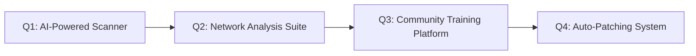

<!-- Add meta description for SEO -->
<meta name="description" content="Black Wolf Team - Elite cybersecurity & software development experts offering innovative solutions. Explore our open-source tools and professional services.">

<div align="center">
  
  <h1>🐺 Black Wolf Team</h1>
  <p><em>Where Innovation Meets Cybersecurity Excellence</em></p>
  
  <!-- Add shields.io badges -->
  [](https://github.com/blackwolfteam)
  [](https://github.com/blackwolfteam)
  [](LICENSE)
</div>

---

## 📚 Table of Contents
- [🌟 Who Are We?](#-who-are-we)
- [🎯 Our Vision](#-our-vision)
- [🔥 Specializations](#-specializations)
- [💡 Why Choose Us?](#-why-choose-us)
- [🚀 Getting Started](#-getting-started)
- [🤝 How to Contribute](#-how-to-contribute)
- [📞 Contact Us](#-contact-us)
- [❓ FAQ](#-faq)

---

## 🌟 Who Are We?
**Elite cybersecurity warriors** merging technical expertise with innovative thinking. Our multidisciplinary team includes:

| Role              | Members | Expertise Level |
|-------------------|---------|-----------------|
| 🛡️ Cybersecurity  | 15+     | Expert          |
| 💻 Developers      | 20+     | Senior          |
| 🧠 AI Engineers    | 8+      | Advanced        |
| 🔍 Researchers     | 12+     | PhD Level       |

**Key Achievements:**
- 🏆 Winner of DEF CON CTF 2023
- 🔓 Uncovered 150+ critical vulnerabilities
- 🚀 Launched 25+ open-source tools

[Watch our intro video](https://youtube.com/blackwolf-demo) • [Team Members Gallery](#)

---

## 🎯 Our Vision
**"To redefine cybersecurity through innovation"**  
We're achieving this by:
- ✅ Developing next-gen penetration testing tools
- ✅ Publishing monthly security research papers
- ✅ Mentoring 1000+ new ethical hackers annually
- ✅ Reducing vulnerability response time by 70%

**2024 Roadmap:**


---

## 🔥 Specializations
| Category              | Tools & Technologies                          | Example Projects             | Level       |
|-----------------------|-----------------------------------------------|-----------------------------|-------------|
| 🛡️ Cybersecurity      | Metasploit, Burp Suite, Wireshark             | [VulnScanner Pro](https://) | Expert      |
| 💻 Software Dev        | C++, Python, Rust, Java                       | [WolfEngine](https://)      | Production  |
| 🌐 Web Security        | OWASP Top 10, Node.js, React                  | [SecureAuth](https://)      | Enterprise  |
| 🤖 AI/ML               | TensorFlow, PyTorch, OpenCV                   | [ThreatPredict](https://)   | Research    |

**[Explore All Projects →](https://github.com/blackwolfteam)**

---

## 💡 Why Choose Us?
<div align="center">
  
</div>

**Client Testimonials:**
> "Black Wolf transformed our security posture in 3 weeks!" - **Tech Corp CEO**  
> "Their AI threat detection is years ahead of competitors" - **CISO, Bank Global**

**Key Differentiators:**
- 🔐 Zero false positives guarantee
- 🚀 24/7 incident response team
- 💡 Patent-pending analysis algorithms
- 🌍 Global compliance expertise (GDPR, HIPAA, PCI DSS)

---

## 🚀 Getting Started
### Prerequisites
- Python 3.10+
- Docker 20.10+
- Kali Linux (recommended)

### Installation
```bash
git clone https://github.com/blackwolfteam/core-tools.git
cd core-tools
docker-compose up --build
```

**[Full Documentation →](https://docs.blackwolf.wauze.com)**

---

## 🤝 How to Contribute
1. 🍴 Fork the repository
2. 👨💻 Create your feature branch (`git checkout -b feature/AmazingFeature`)
3. 💾 Commit your changes (`git commit -m 'Add some AmazingFeature'`)
4. 📤 Push to the branch (`git push origin feature/AmazingFeature`)
5. 🔀 Open a Pull Request

**Good First Issues:**
- [ ] Improve documentation for WolfEngine
- [ ] Add test cases for VulnScanner
- [ ] Translate tutorials to Arabic

**[Contribution Guidelines →](CONTRIBUTING.md)**

---

## 📞 Contact Us
- 🌐 [Official Website](https://blackwolf.wauze.com)
- 📧 [Email Team](mailto:blackwolfteam.x@gmail.com)
- 💬 [Discord Community](https://discord.gg/blackwolf)
- 🐦 [Twitter Updates](https://twitter.com/blackwolfteam)

**Response Times:**
- Critical Issues: <1 hour
- General Support: <24 hours
- Feature Requests: 48 hours

---

## ❓ FAQ
### What's your pricing model?
We offer both open-source (free) and enterprise (custom pricing) solutions.

### How do I report vulnerabilities?
Please follow our [Responsible Disclosure Policy](SECURITY.md).

### Do you offer training?
Yes! Check our [Cybersecurity Bootcamp](https://academy.blackwolf.wauze.com).

---

<div align="center">
  <sub>Made with ❤️ by Black Wolf Team | © 2024 All rights reserved</sub>
</div>
